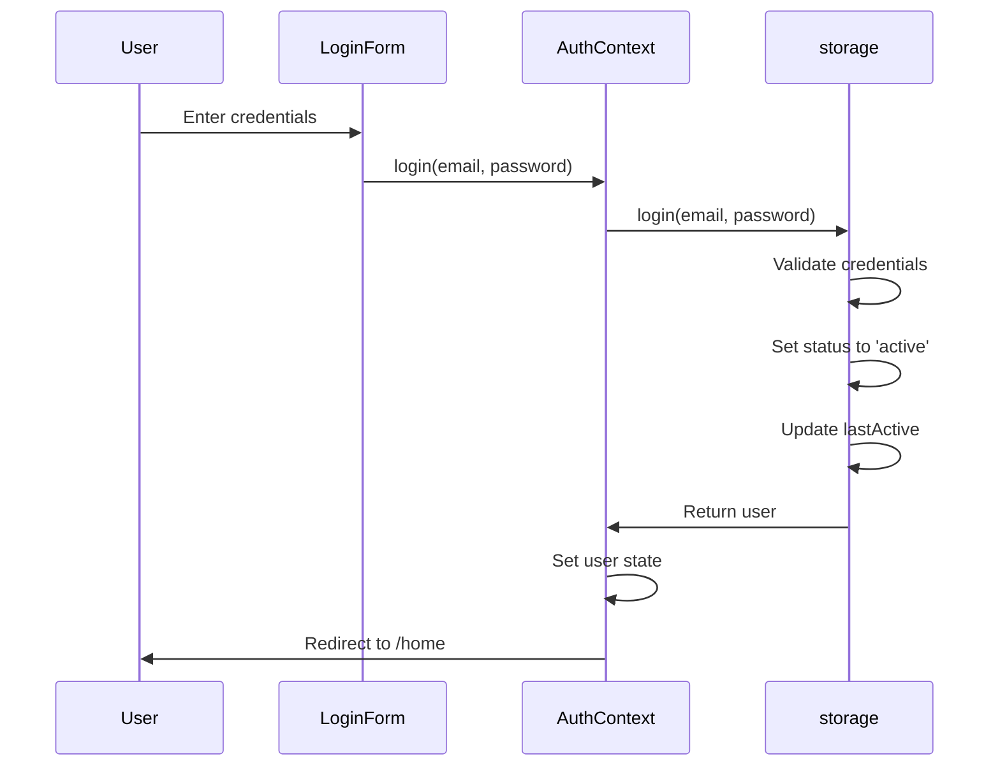
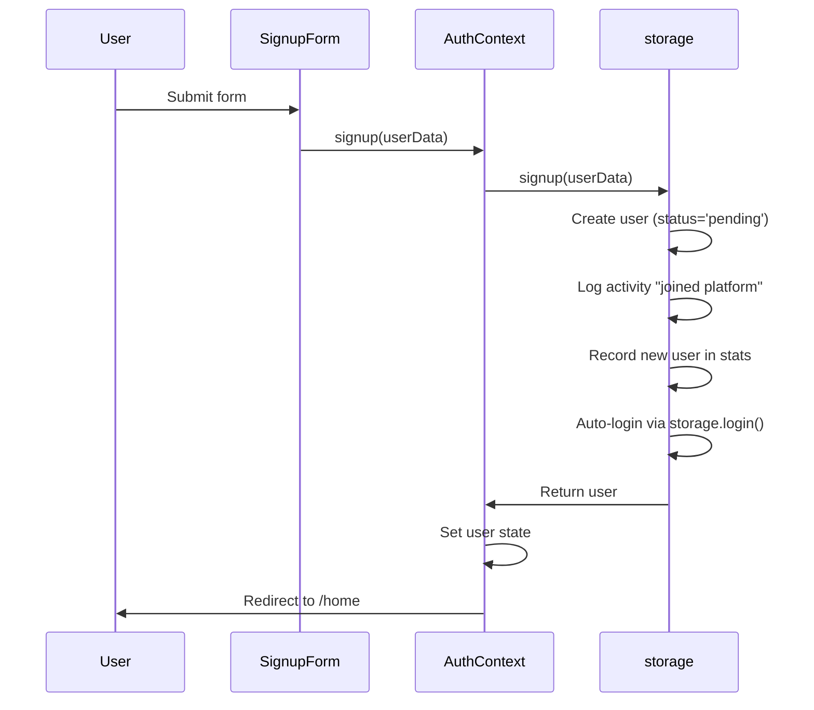
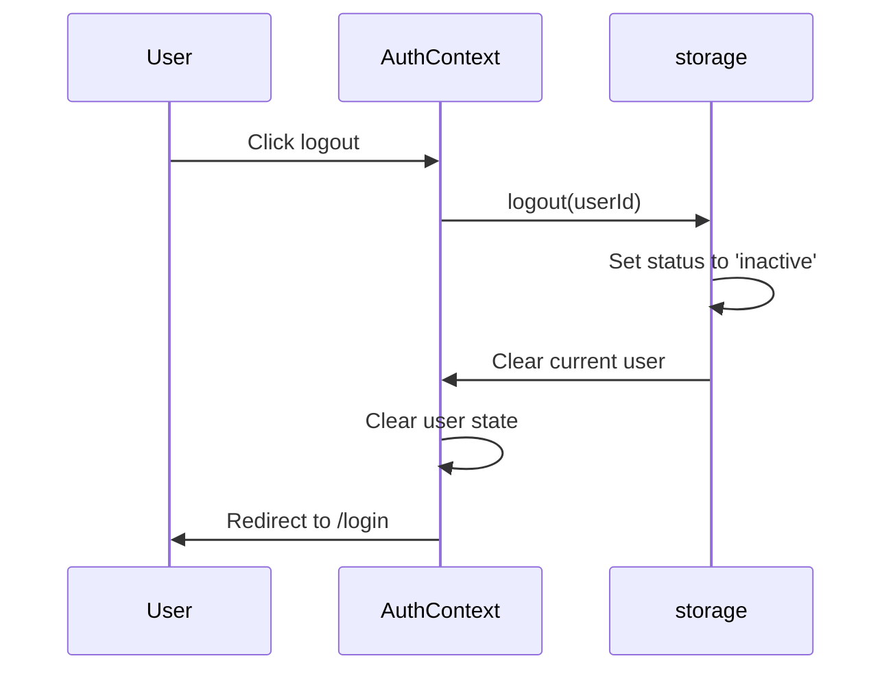
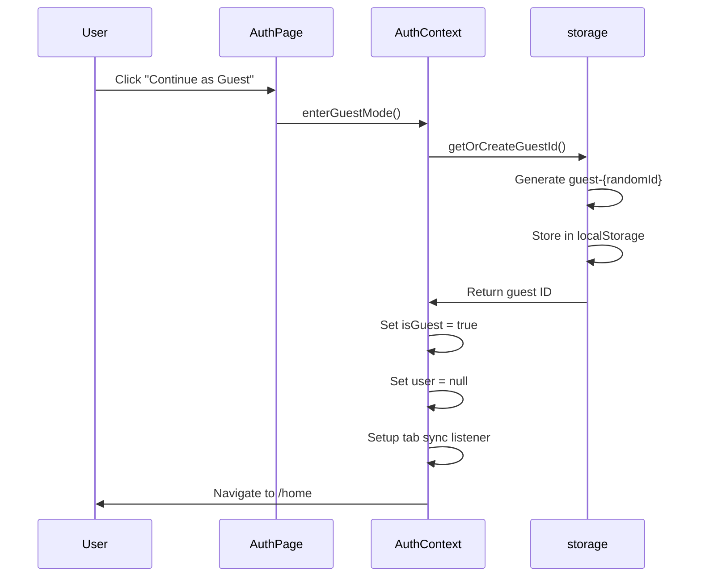

# Kitchen Odyssey - Authentication System

## Authentication Architecture

**Location:** `src/context/AuthContext.jsx`
**Type:** React Context API
**Storage:** localStorage (current) → JWT HttpOnly cookies (target)
**Guest Mode:** Built-in read-only access

## AuthContext API

### Context Provider
```jsx
<AuthProvider>
  <App />
</AuthProvider>
```
- Wraps entire application
- Initializes storage on mount
- Loads current user from localStorage
- Sets up activity tracking heartbeat

### Context Values
```javascript
const {
  // State
  user,                    // Current logged-in user (User | null)
  isGuest,                 // Guest mode flag (boolean)
  loading,                 // Initial loading state (boolean)

  // Actions
  login,                   // (email, password) => Promise<{success, error}>
  signup,                  // (userData) => Promise<{success, error}>
  logout,                  // () => void
  updateProfile,           // (updates) => void
  enterGuestMode,          // () => void

  // Derived Flags
  isAdmin,                 // user.role === 'admin'
  isPending,               // user.status === 'pending'
  isSuspended,             // user.status === 'suspended'
  canInteract,             // user && status==='active' && !isAdmin && !isGuest
} = useAuth()
```

## Authentication Flows

### Login Flow



**Implementation:**
```javascript
const login = async (email, password) => {
  const result = await storage.login(email, password)
  if (result.success) {
    setCurrentUser(result.user)
    // Status already set to 'active' in storage.login()
    // lastActive already updated in storage.login()
  }
  return result
}
```

### Signup Flow



**Implementation:**
```javascript
const signup = async (userData) => {
  const result = await storage.signup(userData)
  if (result.success) {
    // User created with status='pending'
    // Auto-logged in despite pending status
    setCurrentUser(result.user)
  }
  return result
}
```

**Note:** Pending users are logged in but see info banner explaining they need approval.

### Logout Flow



**Implementation:**
```javascript
const logout = () => {
  if (user) {
    storage.logout(user.id)  // Sets status to 'inactive'
    // Does NOT update lastActive (logging out isn't "active" activity)
  }
  setCurrentUser(null)
  navigate('/login')
}
```

### Guest Mode Flow



**Implementation:**
```javascript
const enterGuestMode = () => {
  try {
    const guestId = storage.getOrCreateGuestId()
    setIsGuest(true)
    setCurrentUser(null)
    // Tab sync: Listen for storage changes to sync guest state across tabs
    window.addEventListener('storage', handleStorageChange)
  } catch (error) {
    console.error('Failed to enter guest mode:', error)
  }
}
```

**Guest Mode Characteristics:**
- No localStorage writes (except guest ID)
- No analytics tracking
- Read-only recipe access
- Cannot like, favorite, review, or create recipes
- Guest ID format: `guest-{randomId}`

## User Status Management

### Status States

| Status | Type | Description | Behavior |
|--------|------|-------------|----------|
| `active` | Session | User is currently logged in | Full access |
| `inactive` | Session | User is registered but not logged in | Must login |
| `pending` | Account | New user awaiting admin approval | Logged in but restricted |
| `suspended` | Account | Account locked by admin | Logged in but restricted |

### Status Transitions

```
Initial State: 'inactive'
         ↓
      Login
         ↓
      'active'
         ↓
      Logout
         ↓
      'inactive'
         ↓
      Login (again)
         ↓
      'active'
```

**Persistent States** (survive logout/login):
- `pending`: Set on signup, persists until admin approves
- `suspended`: Set by admin, persists until admin unsuspends

### Derived Flags

```javascript
// In AuthContext
const isAdmin = user?.role === 'admin'
const isPending = user?.status === 'pending'
const isSuspended = user?.status === 'suspended'
const canInteract = user && user.status === 'active' && !isAdmin && !isGuest
```

**Usage:**
```jsx
{canInteract && (
  <Button onClick={handleLike}>Like Recipe</Button>
)}

{isPending && (
  <Alert>Your account is pending admin approval</Alert>
)}

{isSuspended && (
  <Alert>Your account has been suspended</Alert>
)}
```

## Activity Tracking

### Heartbeat (Every 1 minute)

```javascript
// In AuthContext useEffect
useEffect(() => {
  if (!user || isGuest) return

  // Update lastActive every 60 seconds
  const interval = setInterval(() => {
    storage.updateLastActive(user.id)
  }, 60000)

  return () => clearInterval(interval)
}, [user, isGuest])
```

### Page Hide/Unload

```javascript
// Update lastActive when user closes/navigates away
useEffect(() => {
  const handleBeforeUnload = () => {
    if (user && !isGuest) {
      storage.updateLastActive(user.id)
    }
  }

  window.addEventListener('beforeunload', handleBeforeUnload)
  window.addEventListener('pagehide', handleBeforeUnload)

  return () => {
    window.removeEventListener('beforeunload', handleBeforeUnload)
    window.removeEventListener('pagehide', handleBeforeUnload)
  }
}, [user, isGuest])
```

**Note:** `lastActive` is NOT updated on logout (logging out isn't an "active" activity).

### Active User Recording

```javascript
// Record active user hourly (called by heartbeat)
const recordActiveUser = () => {
  if (user && !isGuest) {
    storage.recordActiveUser()
  }
}
```

## Profile Management

### Update Profile

```javascript
const updateProfile = (updates) => {
  if (!user) return

  const updatedUser = { ...user, ...updates }
  storage.saveUser(updatedUser)
  setCurrentUser(updatedUser)  // Update context state
}
```

**Supported Updates:**
- `firstName`, `lastName`
- `username`
- `email`
- `avatar` (6 presets or custom URL)
- `bio`
- `location`
- `cookingLevel`

**Read-Only Fields:**
- `id`, `joinedDate`
- `role`, `status` (admin-only)
- `favorites`, `viewedRecipes` (managed by system)

## Cross-Tab Synchronization

### User State Sync
```javascript
// Listen for storage changes to sync auth state across tabs
useEffect(() => {
  const handleStorageChange = (e) => {
    if (e.key === 'cookhub_current_user') {
      const newUser = JSON.parse(e.newValue)
      setCurrentUser(newUser)
    }
  }

  window.addEventListener('storage', handleStorageChange)
  return () => window.removeEventListener('storage', handleStorageChange)
}, [])
```

### Guest Mode Sync
```javascript
// Sync guest state across tabs
useEffect(() => {
  if (isGuest) {
    const handleStorageChange = (e) => {
      if (e.key === 'cookhub_guest_id' && !e.newValue) {
        // Guest logged out in another tab
        setIsGuest(false)
      }
    }

    window.addEventListener('storage', handleStorageChange)
    return () => window.removeEventListener('storage', handleStorageChange)
  }
}, [isGuest])
```

## Route Protection

### AuthLayout (Public Routes)
```jsx
const AuthLayout = () => {
  const { user, isGuest } = useAuth()

  useEffect(() => {
    // Redirect to home if already logged in
    if (user || isGuest) {
      navigate('/home')
    }
  }, [user, isGuest])

  return <Outlet />
}
```

**Routes:** `/login`, `/signup`

### RootLayout (Protected Routes)
```jsx
const RootLayout = () => {
  const { user, isGuest, loading } = useAuth()

  useEffect(() => {
    if (loading) return

    // Redirect to login if not logged in (guest bypass)
    if (!user && !isGuest) {
      navigate('/login')
    }
  }, [user, isGuest, loading])

  return <Outlet />
}
```

**Routes:** `/home`, `/search`, `/profile`, `/recipe/:id`, `/create-recipe`

### AdminLayout (Admin-Only Routes)
```jsx
const AdminLayout = () => {
  const { user, isAdmin } = useAuth()

  useEffect(() => {
    if (!user || !isAdmin) {
      navigate('/home')
    }
  }, [user, isAdmin])

  return <Outlet />
}
```

**Routes:** `/admin`, `/admin/recipes`, `/admin/users`

## Event-Driven Updates

### Favorite Toggled Event
```javascript
useEffect(() => {
  const handleFavoriteToggled = () => {
    // Reload current user to sync favorites
    const refreshedUser = storage.getUserById(user.id)
    setCurrentUser(refreshedUser)
  }

  window.addEventListener('favoriteToggled', handleFavoriteToggled)
  return () => window.removeEventListener('favoriteToggled', handleFavoriteToggled)
}, [user])
```

## Password Management

### Current (localStorage)
- Passwords stored in **plain text**
- No password hashing
- No password reset flow

### Target (Backend)
- **bcrypt** hashing with salt rounds
- Password reset via email token
- Password strength validation
- Password change endpoint

## Error Handling

### Login Errors
```javascript
// storage.login() returns:
{
  success: false,
  error: 'User not found' | 'Invalid password' | 'Account pending' | 'Account suspended'
}
```

### Signup Errors
```javascript
// storage.signup() returns:
{
  success: false,
  error: 'Email already exists' | 'Username already exists' | 'Validation failed'
}
```

## Security Considerations

### Current (Client-Side)
- **XSS Protection:** React auto-escapes user input
- **Credential Storage:** Plain text in localStorage (will be fixed in backend)
- **Session Management:** No token expiration

### Target (Backend)
- **Password Hashing:** bcrypt with 10+ salt rounds
- **JWT Tokens:** HttpOnly cookies, short expiration (15 min)
- **Refresh Tokens:** Separate refresh token rotation
- **CSRF Protection:** SameSite cookies, CSRF tokens
- **Rate Limiting:** Per-IP and per-user limits on auth endpoints

## Migration to JWT

### Current: localStorage
```javascript
// Current implementation
storage.login(email, password) → { success, user }
storage.getCurrentUser() → User | null
```

### Target: JWT + HttpOnly Cookies
```javascript
// API-based implementation
POST /api/v1/auth/login → { success, user }
// Server sets HttpOnly cookie with JWT
GET /api/v1/auth/me → { user }  // Verifies JWT from cookie
POST /api/v1/auth/logout → Clears cookie
```

### Migration Pattern
```javascript
// storage.js becomes adapter
const USE_API = import.meta.env.VITE_USE_BACKEND_API === 'true'

export const storage = {
  async login(email, password) {
    if (USE_API) {
      return await fetch('/api/v1/auth/login', {
        method: 'POST',
        headers: { 'Content-Type': 'application/json' },
        credentials: 'include',  // Send cookies
        body: JSON.stringify({ email, password })
      }).then(r => r.json())
    }
    // Fallback to localStorage
    return localStorageLogin(email, password)
  }
}
```

## Related Documentation
- [data-models.md](./data-models.md) - User model and schema
- [architecture.md](./architecture.md) - System architecture
- [project-overview.md](./project-overview.md) - Project overview

## Memory Management
- **Project:** Kitchen_Odyssey (React frontend)
- **Last Updated:** 2026-02-17
- **Maintained By:** Serena MCP Server
- **Purpose:** Authentication system reference
